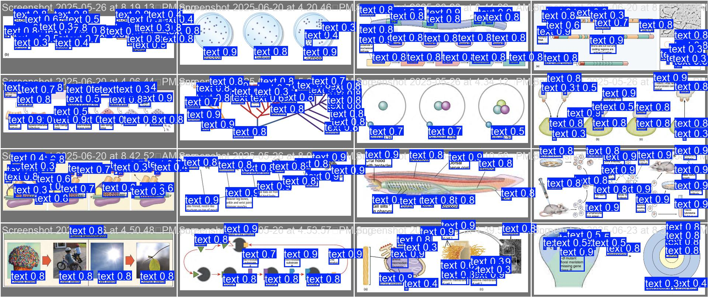
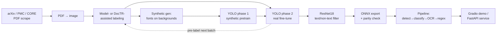
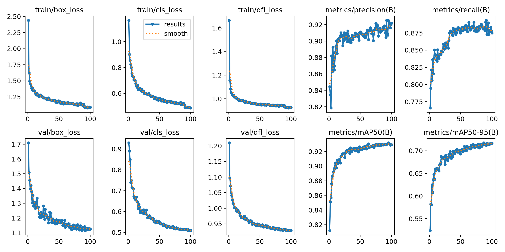
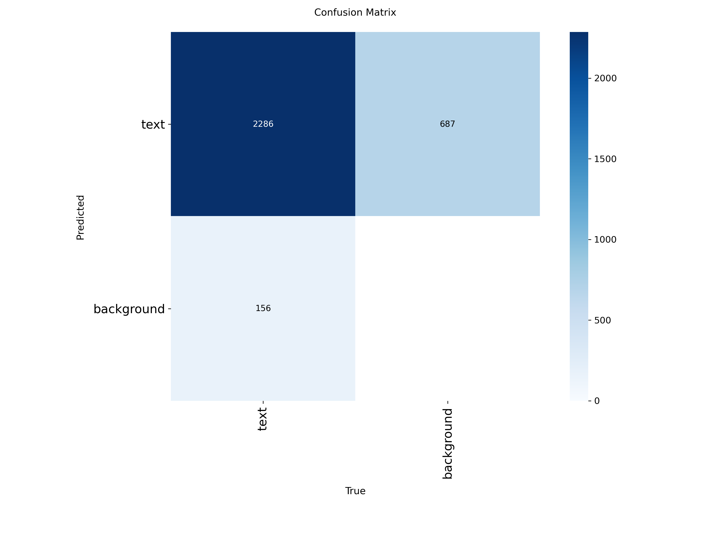
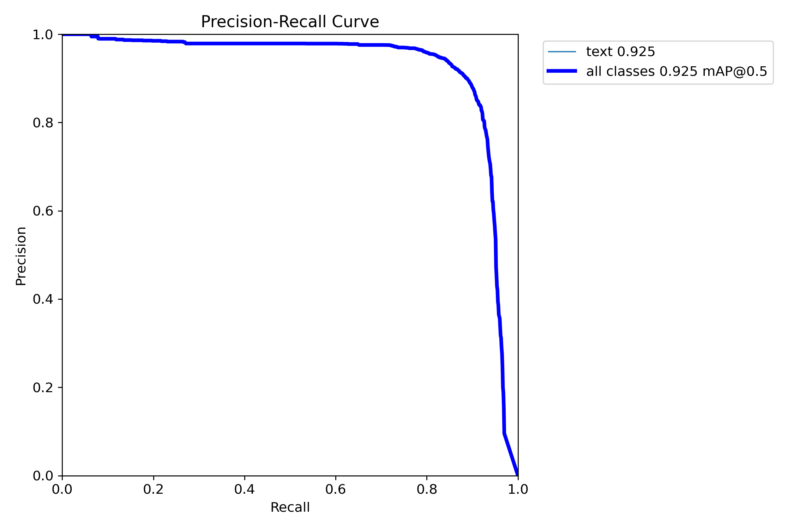

<div align="center">

# flashmask

**Detect and mask text regions in diagram images — to turn any figure into a study flashcard.**

[](LICENSE)
[](pyproject.toml)
[](https://github.com/astral-sh/ruff)
[](https://github.com/beimichen/flashmask/actions/workflows/ci.yml)

<em>YOLO detector → text/non-text classifier → OCR → regex filter → ONNX inference</em>

</div>

---

## What it does

Given a diagram, slide, or paper figure, **flashmask** finds the text and masks it
— so the image becomes a "fill in the blank" flashcard. It's an end-to-end
computer-vision system: data acquisition, an OCR-assisted labeling tool, synthetic
data generation, two-phase detector training, a false-positive filter, ONNX export,
and a deployable inference service.

<div align="center">

<br/><sub>Model predictions on held-out validation images.</sub>
</div>

## Results

Detector performance on the held-out **real** validation split (YOLO-s @ 960px,
best checkpoint). Full curves in [`reports/figures/`](reports/figures).

| Model stage | Precision | Recall | mAP@0.50 | mAP@0.50:0.95 |
|---|:---:|:---:|:---:|:---:|
| Synthetic pretrain only | — | — | lower | lower |
| **+ real-data fine-tune (final)** | **0.917** | **0.883** | **0.929** | **0.717** |
| + ResNet18 text filter (inference) | ↑ precision | — | — | — |

> The ResNet18 text/non-text filter plus an OCR + regex word filter run at
> inference to trade a little recall for higher precision — masking *words*, not
> every stray glyph, measurement, or equation symbol.

See the [Model Card](docs/MODEL_CARD.md) for training details, thresholds, and
provenance of these numbers.

## How it works



**Two-phase training** is the core idea: real labelled diagrams are scarce, so the
detector is pretrained on abundant synthetic text-on-background images (heavy
augmentation), then fine-tuned on the real set (light augmentation, frozen stem).

**Model-in-the-loop labeling (data flywheel).** Labeling starts with DocTR OCR,
but once a detector is trained the labeling tool loads it and pre-labels new
images from the model's *own* predictions — the annotator just corrects them
(`models/detector.onnx` present → model; absent → DocTR). Corrected labels feed
the next fine-tune, so each round refines the latest model instead of starting
from scratch. This is a human-in-the-loop loop by design (you review every
batch), not a fully autonomous retrainer.

## Built with

`Ultralytics YOLO` · `PyTorch` · `python-doctr` · `RapidOCR` · `ONNX Runtime` ·
`Hydra` · `DVC` · `MLflow` · `FastAPI` · `Gradio` · `Streamlit` · `uv` · `Ruff` ·
`pytest` · `GitHub Actions`

## Quickstart

Requires [uv](https://docs.astral.sh/uv/getting-started/installation/).

```bash
git clone https://github.com/beimichen/flashmask && cd flashmask
just setup            # create .venv and install (lightweight inference deps)
just sample           # generate a few placeholder diagrams to play with
just test             # run the test suite
just demo             # launch the Gradio demo
```

The demo and API auto-detect a detector at `models/detector.onnx`. Weights are
**not committed** (see [models/README.md](models/README.md)); without them the demo
still launches and explains how to train or supply a model. To run the full
training pipeline, install the training stack: `uv sync --extra train`.

## Usage

```python
import cv2
from flashmask.inference.pipeline import TextMaskPipeline

pipe = TextMaskPipeline("models/detector.onnx", "models/text_classifier.onnx")
img = cv2.imread("diagram.png")
regions = pipe.run(img)                 # -> list[Region]
flashcard = pipe.mask(img, regions)     # text boxes filled in
cv2.imwrite("flashcard.png", flashcard)
```

Train both phases of the detector (data required):

```bash
# Phase 1 — pretrain on synthetic data
python -m flashmask.modeling.train_detector train=pretrain_synthetic data=synthetic
# Phase 2 — fine-tune on real data from the phase-1 checkpoint
python -m flashmask.modeling.train_detector train=finetune_real data=real \
    model.weights=runs/pretrain_synthetic/weights/best.pt
```

The nine former `train_*.py` variants are gone: every recipe is now a
[Hydra config](configs/) you compose on the command line.

## Results & methodology

<div align="center">

</div>

- **Detection:** YOLO-s at 960px. Two-phase schedule (synthetic → real); exact
  hyperparameters in [`configs/train/`](configs/train).
- **False-positive filtering:** a ResNet18 text/non-text classifier on each crop,
  then RapidOCR + regex heuristics reject measurements (`5 mm`), bare equations
  (`a = b`), and symbol/number-only boxes.
- **Evaluation:** metrics on a **real-only** split; synthetic data never enters the
  test set (`flashmask.data.splits` enforces scene-grouped, leakage-safe splits).
- **Deployment:** ONNX export with a `.pt`-vs-`.onnx` parity check, served via a
  CPU-only FastAPI app and a Gradio UI.

<div align="center">


</div>

## Project structure

```
src/flashmask/      data/ labeling/ modeling/ inference/ serving/  (the package)
configs/            Hydra config groups — one trainer, many recipes
apps/               Gradio demo + Streamlit labeling tool
scripts/            sample-data generator
tests/              unit tests (pure logic; ONNX-parity test skips w/o weights)
docs/               model card + dataset card
reports/figures/    training curves, confusion matrix, example predictions
data/  models/      gitignored (only data/sample/ + figures are committed)
```

## Reproducibility

Seeds are set across Python/NumPy/PyTorch (`flashmask.set_seed`) and Ultralytics
runs with `deterministic=True`; the resolved Hydra config + git SHA are logged to
MLflow each run, and the data → model DAG is captured in
[`dvc.yaml`](dvc.yaml). Note PyTorch does not guarantee bit-identical results
across different hardware/GPUs.

## Limitations & next steps

- **Best-effort masking, not redaction** — missed detections leave text visible.
- **Sim-to-real gap** from synthetic pretraining; domain skews toward STEM figures.
- The dataset and weights are not redistributed (licensing); the committed sample
  set is synthetic placeholders.
- **Next:** host `detector.onnx` on the Hugging Face Hub to make the Gradio demo a
  fully-live public Space; add rotated-box support for vertical/diagonal labels.

## License

MIT — see [LICENSE](LICENSE). Author: **Bei Mi Chen** ·
[github.com/beimichen](https://github.com/beimichen)
